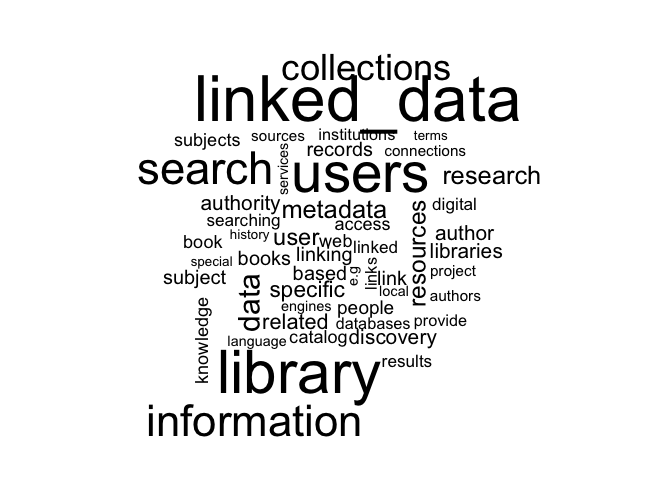

```r
# Load libraries

library(tidyverse)
```

```
## Loading tidyverse: ggplot2
## Loading tidyverse: tibble
## Loading tidyverse: tidyr
## Loading tidyverse: readr
## Loading tidyverse: purrr
## Loading tidyverse: dplyr
```

```
## Conflicts with tidy packages ----------------------------------------------
```

```
## filter(): dplyr, stats
## lag():    dplyr, stats
```

```r
library(tidytext)
library(knitr)
library(stringr)
library(kableExtra)
data("stop_words")
library(wordcloud)
```

```
## Loading required package: RColorBrewer
```

```r
# Load data
ld_survey <- read_csv("data/ld_survey_anonymized_20180301.csv")
```

```
## Parsed with column specification:
## cols(
##   response_id = col_character(),
##   linked_data_benefits = col_character(),
##   reviewer1_benefits_quality = col_integer(),
##   reviewer2_benefits_quality = col_integer(),
##   reviewer3_benefits_quality = col_integer(),
##   reviewer4_benefits_quality = col_integer(),
##   features_score_total = col_integer()
## )
```

```r
names(ld_survey) <- c("response_id", "ld_features", "rev1_score", "rev2_score", "rev3_score", "rev4_score", "features_total_score")
```


# Remove responses with 0 feature total score


```r
ld_survey_nonzero <- ld_survey %>%
  filter(features_total_score > 0)
```

# Review words in non-zero feature responses


```r
tidy_words <- ld_survey_nonzero %>% 
  unnest_tokens(word, ld_features) %>%
  count(word, sort = TRUE)
```

# Remove stop words


```r
tidy_words <- ld_survey_nonzero %>% 
  unnest_tokens(word, ld_features) %>%
  count(word, sort = TRUE)

tidy_words_stopped <- tidy_words %>%
  anti_join(stop_words)
```

```
## Joining, by = "word"
```


# Let's go back a step and clean up the data a little by normalizing permutations of "linked data" then take a look


```r
ld_survey_cleaned <- ld_survey_nonzero
ld_survey_cleaned$ld_features <- str_replace_all(ld_survey_cleaned$ld_features, "linked data", "linked_data")
ld_survey_cleaned$ld_features <- str_replace_all(ld_survey_cleaned$ld_features, "linked open data", "linked_data")
ld_survey_cleaned$ld_features <- str_replace_all(ld_survey_cleaned$ld_features, "lod", "linked_data")


tidy_words_stopped <- ld_survey_cleaned %>% 
  unnest_tokens(word, ld_features) %>%
  count(word, sort = TRUE) %>%
  anti_join(stop_words) 
```

```
## Joining, by = "word"
```

# Wordcloud (a bit unpredictable)


```r
tidy_words_stopped %>%
  with(wordcloud(word, n, max.words = 50))
```

<!-- -->


```r
tidy_words_tf <- ld_survey_cleaned %>% 
  unnest_tokens(word, ld_features) %>%
  count(response_id, word, sort = TRUE) %>%
  anti_join(stop_words) %>%
  ungroup()
```

```
## Joining, by = "word"
```

```r
total_words <- tidy_words_tf %>%
  group_by(response_id) %>%
  summarize(total = sum(n))

tidy_words_tf <- left_join(tidy_words_tf, total_words)
```

```
## Joining, by = "response_id"
```

```r
freq_by_rank <- tidy_words_tf %>%
  group_by(response_id) %>%
  mutate(rank = row_number(), term_frequency = n/total)

words_tf_idf <- tidy_words_tf %>%
  bind_tf_idf(word, response_id, n)
```


