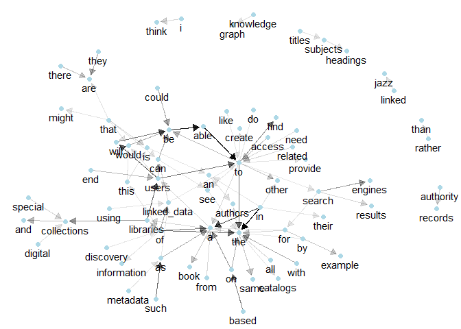

# eda6 - Bigrams no stop words
Adam Chandler  
3/28/2018  


# Prepare data


```r
# Load libraries

library(tidyverse)
```

```
## Loading tidyverse: ggplot2
## Loading tidyverse: tibble
## Loading tidyverse: tidyr
## Loading tidyverse: readr
## Loading tidyverse: purrr
## Loading tidyverse: dplyr
```

```
## Conflicts with tidy packages ----------------------------------------------
```

```
## filter(): dplyr, stats
## lag():    dplyr, stats
```

```r
library(tidytext)
library(knitr)
library(stringr)
library(kableExtra)
```

```
## Warning: package 'kableExtra' was built under R version 3.4.4
```

```r
data("stop_words")
library(igraph)
```

```
## Warning: package 'igraph' was built under R version 3.4.4
```

```
## 
## Attaching package: 'igraph'
```

```
## The following objects are masked from 'package:dplyr':
## 
##     as_data_frame, groups, union
```

```
## The following objects are masked from 'package:purrr':
## 
##     compose, simplify
```

```
## The following object is masked from 'package:tidyr':
## 
##     crossing
```

```
## The following object is masked from 'package:tibble':
## 
##     as_data_frame
```

```
## The following objects are masked from 'package:stats':
## 
##     decompose, spectrum
```

```
## The following object is masked from 'package:base':
## 
##     union
```

```r
library(ggraph)
```

```
## Warning: package 'ggraph' was built under R version 3.4.4
```


```r
# Remove responses with 0 feature total score and normalize(i.e., linked data)

clean_features_text <- function(ld_survey) {
  ld_survey_nonzero <- ld_survey %>%
    filter(features_total_score > 0)
  ld_survey_cleaned <- ld_survey_nonzero
  ld_survey_cleaned$ld_features <- str_replace_all(ld_survey_cleaned$ld_features, regex("linked data", ignore_case = TRUE), "linked_data")
  ld_survey_cleaned$ld_features <- str_replace_all(ld_survey_cleaned$ld_features, regex("linked open data", ignore_case = TRUE), "linked_data")
  ld_survey_cleaned$ld_features <- str_replace_all(ld_survey_cleaned$ld_features, regex(" lod ", ignore_case = TRUE), " linked_data ")
  ld_survey_cleaned$ld_features <- str_replace_all(ld_survey_cleaned$ld_features, regex(" user ", ignore_case = TRUE), " users ")
  ld_survey_cleaned$ld_features <- str_replace_all(ld_survey_cleaned$ld_features, regex("collection ", ignore_case = TRUE), "collections ")  
  ld_survey_cleaned$ld_features <- str_replace_all(ld_survey_cleaned$ld_features, regex("resource ", ignore_case = TRUE), "resources ")  
  ld_survey_cleaned$ld_features <- str_replace_all(ld_survey_cleaned$ld_features, regex("library ", ignore_case = TRUE), "libraries ")  
  ld_survey_cleaned$ld_features <- str_replace_all(ld_survey_cleaned$ld_features, regex("author ", ignore_case = TRUE), "authors ")  
    ld_survey_cleaned$ld_features <- str_replace_all(ld_survey_cleaned$ld_features, regex("engine ", ignore_case = TRUE), "engines ")  
    ld_survey_cleaned$ld_features <- str_replace_all(ld_survey_cleaned$ld_features, regex("subject ", ignore_case = TRUE), "subjects ")  
      ld_survey_cleaned$ld_features <- str_replace_all(ld_survey_cleaned$ld_features, regex("bibliographic ", ignore_case = TRUE), "bibliographical ")  
      ld_survey_cleaned$ld_features <- str_replace_all(ld_survey_cleaned$ld_features, regex("catalog ", ignore_case = TRUE), "catalogs ")  
    ld_survey_cleaned$ld_features <- str_replace_all(ld_survey_cleaned$ld_features, regex("item ", ignore_case = TRUE), "items ")  
    ld_survey_cleaned$ld_features <- str_replace_all(ld_survey_cleaned$ld_features, regex("record ", ignore_case = TRUE), "records ")  
    ld_survey_cleaned$ld_features <- str_replace_all(ld_survey_cleaned$ld_features, regex("article ", ignore_case = TRUE), "articles ")  

        return(ld_survey_cleaned)
}


# Load data
ld_survey <- read_csv("data/ld_survey_anonymized_20180301.csv")
```

```
## Parsed with column specification:
## cols(
##   response_id = col_character(),
##   linked_data_benefits = col_character(),
##   reviewer1_benefits_quality = col_integer(),
##   reviewer2_benefits_quality = col_integer(),
##   reviewer3_benefits_quality = col_integer(),
##   reviewer4_benefits_quality = col_integer(),
##   features_score_total = col_integer()
## )
```

```r
names(ld_survey) <- c("response_id", "ld_features", "rev1_score", "rev2_score", "rev3_score", "rev4_score", "features_total_score")

# clean data
ld_survey_cleaned <- clean_features_text(ld_survey)
```


# Create bigrams. Do not remove stop words this time


```r
bigrams <- ld_survey_cleaned %>%
  unnest_tokens(bigram, ld_features, token = "ngrams", n = 2) %>% 
  select(response_id, bigram) %>% 
  arrange(response_id)

bigrams_count <- bigrams %>%
  count(bigram, sort = TRUE)

bigram_counts_separated <- bigrams %>%
  select(bigram) %>%
  separate(bigram, c("word1", "word2"), sep = " ") %>%
#  filter(!word1 %in% stop_words$word, 
#         !word2 %in% stop_words$word) %>%
  count(word1, word2, sort = TRUE)

bigram_counts_separated %>% 
  filter(str_detect(word1, "linked_data" ) | str_detect(word2, "linked_data"))
```

```
## # A tibble: 74 x 3
##          word1       word2     n
##          <chr>       <chr> <int>
##  1          of linked_data     8
##  2 linked_data         can     5
##  3          as linked_data     4
##  4 linked_data          to     4
##  5       using linked_data     4
##  6 linked_data       could     3
##  7 linked_data          is     3
##  8         the linked_data     3
##  9         use linked_data     3
## 10           a linked_data     2
## # ... with 64 more rows
```

```r
bigram_counts_separated
```

```
## # A tibble: 4,157 x 3
##        word1 word2     n
##        <chr> <chr> <int>
##  1        in   the    20
##  2      able    to    19
##  3        be  able    18
##  4        in     a    15
##  5 libraries users    13
##  6      such    as    13
##  7     users  will    13
##  8        of   the    12
##  9        to   the    12
## 10     users    to    12
## # ... with 4,147 more rows
```

# Graph bigrams without stop words


```r
bigram_graph <- bigram_counts_separated %>%
  filter(n > 3) %>%
  graph_from_data_frame()


set.seed(2017)
a <- grid::arrow(type = "closed", length = unit(.10, "inches"))
ggraph(bigram_graph, layout = "fr") +
  geom_edge_link(aes(edge_alpha = n), show.legend = FALSE, arrow = a, end_cap = circle(.07, 'inches')) +
  geom_node_point(color = "lightblue", size = 2) +
  geom_node_text(aes(label = name), vjust = 1.5, hjust = 0.5) +
  theme_void()
```

<!-- -->

```r
ggsave(plot = last_plot(), filename = "output/ld_study_bigraph_nostops.png", height = 7, width = 10, units = "in", dpi = 300)
```


